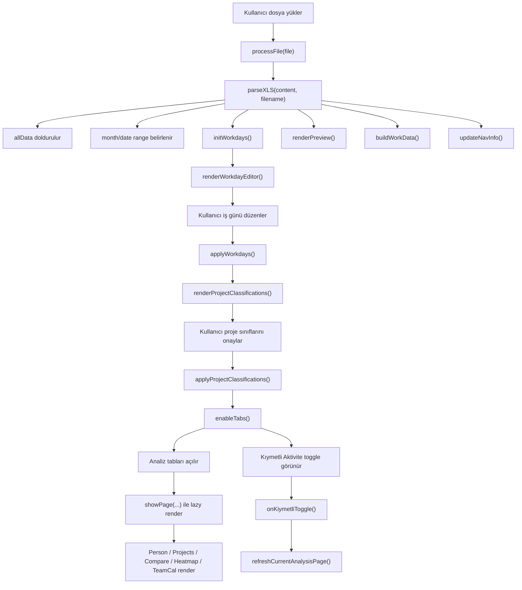

**!!!TASLAK!!!**

# SAP Aktivite Analizörü - Derin Teknik ve İş Kuralı Dokümantasyonu

Bu doküman, repodaki tek dosyalık web uygulaması olan `analyzer.html` dosyasının ayrıntılı teknik çözümlemesidir. Amaç yalnızca "uygulama ne yapıyor?" sorusunu cevaplamak değil; aynı zamanda:

- hangi veriyi beklediğini,
- bu veriyi nasıl parse ettiğini,
- hangi state'leri tuttuğunu,
- hangi ekranları nasıl ürettiğini,
- utilization ve "kıymetli aktivite" gibi iş kurallarını nasıl uyguladığını,
- kodun yorumları ile gerçek davranışı arasında nerelerde fark bulunduğunu

tek yerde açık hale getirmektir.

Bu README, mevcut kodun fiilen yaptığı davranışı temel alır.

---

## 1. Kısa Özet

Bu proje, SAP'den alınan HTML tabanlı `.XLS` export dosyalarını tamamen tarayıcı tarafında analiz eden, backend'siz, build'siz, tek HTML dosyalık bir dashboard uygulamasıdır.

Ana kullanım amacı:

- aylık aktivite raporunu yüklemek,
- ekip bazında kişi/proje dağılımlarını görmek,
- iş günü potansiyelini manuel düzeltmek,
- utilization hesaplamak,
- projeleri "kıymetli / kıymetsiz" diye sınıflandırmak,
- ekip ve kişi analizlerini farklı bakışlarla incelemek.

Uygulama bir SPA gibi davranır ama gerçek bir framework kullanmaz. Her şey aynı dosyada bulunur:

- HTML iskeleti
- tüm CSS
- tüm JavaScript state ve render mantığı

---

## 2. Repo Yapısı

Repoda görülen dosyalar:

| Yol | Rol |
|---|---|
| `analyzer.html` | Uygulamanın tamamı. Tek runtime dosyası. |
| `export.XLS` | SAP export örneği. Parser'ın hedeflediği veri formatını gösteriyor. |
| `context/context.md` | Önceki geliştirme oturumlarının bağlam notları. Runtime parçası değil. |
| `scopes/kiymetli-aktivite.md` | "Kıymetli aktivite" özelliğinin ürün/spec dokümanı. Runtime parçası değil. |

Pratikte çalışan proje `analyzer.html` dosyasından ibarettir.

---

## 3. Teknoloji ve Çalışma Modeli

### 3.1 Kullanılan teknolojiler

- Saf HTML
- Saf CSS
- Saf JavaScript
- [Chart.js 4.4.0](https://cdn.jsdelivr.net/npm/chart.js@4.4.0/dist/chart.umd.min.js)
- [chartjs-plugin-datalabels 2.2.0](https://cdn.jsdelivr.net/npm/chartjs-plugin-datalabels@2.2.0/dist/chartjs-plugin-datalabels.min.js)

### 3.2 Kullanılmayan şeyler

- backend yok
- veritabanı yok
- npm yok
- bundler yok
- modül sistemi yok
- framework yok
- state management kütüphanesi yok

### 3.3 Çalışma modeli

Uygulama dosya yüklenince:

1. dosyayı `FileReader` ile text olarak okur,
2. HTML içinden `<tr>` ve `<td>` regex ile çıkarır,
3. satırları JS object'lerine dönüştürür,
4. global state'lere yazar,
5. ekranları state'e göre tekrar render eder.

Bu yüzden uygulama tamamen in-memory çalışır; sayfa yenilenince bütün state kaybolur.

---

## 4. Dosya Anatomisi

`analyzer.html` yaklaşık şu katmanlara ayrılmıştır:

| Bölüm | İçerik |
|---|---|
| `<head>` başlangıcı | meta etiketleri, başlık, Chart.js CDN script'leri |
| büyük `<style>` bloğu | tema token'ları, grid/card yapıları, takvim, heatmap, team calendar, toggle'lar, responsive kurallar |
| `<body>` üstü | sticky navigation |
| upload page | yükleme, iş günü editörü, proje sınıflandırması, preview alanı |
| analysis page'leri | kişi, proje, karşılaştırma, heatmap, ekip takvimi |
| büyük `<script>` bloğu | state, parser, render fonksiyonları, chart helper'ları, event listener'lar |

Kısaca dosya yapısı:

```text
analyzer.html
├─ head
│  ├─ meta
│  ├─ Chart.js CDN
│  └─ tüm CSS
├─ body
│  ├─ nav
│  ├─ page-upload
│  ├─ page-person
│  ├─ page-projects
│  ├─ page-compare
│  ├─ page-heatmap
│  ├─ page-teamcal
│  └─ tüm JS
```

---

## 5. Uygulamanın Uçtan Uca Akışı

### 5.1 Kullanıcı akışı



### 5.2 Gerçek ekran sıralaması

Kodun fiili davranışı şöyledir:

1. Dosya yüklenir.
2. `workday-section` görünür olur.
3. `preview-section` de aynı anda görünür olur.
4. Kullanıcı "İş Günü Düzenleyici" adımını uygular.
5. Sonra "Proje Sınıflandırması" bölümü görünür.
6. Kullanıcı proje sınıflarını onaylar.
7. Tab'lar açılır.
8. Nav bar'daki "Kıymetli Aktiviteye Göre" toggle görünür olur.

Bu önemli bir nokta çünkü yorumlar/spec akışında preview'nin proje sınıflandırmasından sonra açılması bekleniyor; mevcut kodda preview daha erken gösteriliyor.

---

## 6. Ekranlar ve Kullanıcıya Gösterilen Ana Fonksiyonlar

### 6.1 Upload ekranı

Görevleri:

- dosya seçimi veya drag-and-drop
- dosya başarı/başarısızlık durumu
- iş günü düzenleme
- proje kıymet sınıflandırması
- temel veri özeti

### 6.2 Kişi Analizi ekranı

Gösterdikleri:

- kişi seçme chip'leri
- seçilen kişi için toplam saat
- utilization
- proje dağılımı donut chart
- sıralı proje çubukları
- günlük takvim görünümü
- subtype dağılımı
- utilization gauge
- proje detay tablosu

### 6.3 Proje İstatistikleri ekranı

Gösterdikleri:

- proje sayısı ve toplam saatler
- top-10 proje saat dağılımı
- proje pasta grafiği
- tüm projeler tablosu

### 6.4 Karşılaştırma ekranı

Gösterdikleri:

- ekip ortalama utilization banner'ı
- kişi bazlı utilization karşılaştırması
- kişi başı toplam saat
- kişi başı proje sayısı
- performans özeti tablosu
- ekip toplam günlük trendi
- subtype ve lokasyon dağılımı

### 6.5 Heatmap ekranı

Gösterdikleri:

- kişi x proje matrisi
- metrik seçimi: saat / gün / yüzde
- satır ve sütun toplamları
- yoğunluğa göre renk

### 6.6 Ekip Takvimi ekranı

Gösterdikleri:

- gün x kişi matrisi
- filtre: tüm günler / sadece iş günleri
- mod: toplam saat / durum rengi
- gün bazlı beklenen saate göre durum

---

## 7. Global State Modeli

Kodun kalbi global state değişkenleridir.

| Değişken | Tip | Anlamı |
|---|---|---|
| `rawData` | `Array` | Tanımlı ama kullanılmıyor. |
| `workData` | `Array` | Tatil satırları filtrelenmiş kayıtlar. |
| `allData` | `Array` | Parse edilen tüm kayıtlar. |
| `workdays` | `Object` | `YYYY-MM-DD -> 1 / 0.5 / 0` iş günü haritası. |
| `monthLabel` | `string` | Ekranda gösterilen ay etiketi. |
| `monthYear` | `number` | Aktif ayın yılı. |
| `monthMo` | `number` | Aktif ayın 0-based ay indeksi. |
| `dataMinDate` | `string` | Veri içindeki ilk tarih. |
| `dataMaxDate` | `string` | Veri içindeki son tarih. |
| `projectClassifications` | `Object` | `proje -> true/false`, kıymetli sınıflandırması. |
| `kiymetliAktiviteToggle` | `boolean` | Utilization ve bazı görünümler kıymetli-only mi? |
| `selectedPerson` | `string \| null` | Kişi analizi ekranında seçili kişi. |
| `chartInstances` | `Object` | Oluşturulan Chart.js instance'ları. |

### 7.1 Veri nesnesi şeması

`allData` ve `workData` içindeki her kayıt şu şekildedir:

```js
{
  date: "YYYY-MM-DD",
  person: "Kişi Adı",
  project: "Proje/Ağ plan numarası",
  hours: Number,
  days: Number,
  empType: String,
  location: String,
  subtype: String,
  devId: String,
  desc: String
}
```

---

## 8. Kaynak Veri Sözleşmesi: Parser Hangi Kolonları Kullanıyor?

Parser ilk satırı header kabul ediyor ve sonraki satırlardan yalnızca `r[0]` alanı `YYYY-MM-DD` formatındaysa kaydı veri sayıyor.

Örnek `export.XLS` başlıkları şunlar:

| İndeks | Kaynak kolon adı | İç state alanı | Kullanım |
|---|---|---|---|
| `0` | `Planlanan Tarih` | `date` | Tüm tarih bazlı akışlar |
| `1` | `Personel adı` | `person` | kişi bazlı ekranlar |
| `2` | `Ağ plan numarası` | `project` | projeyi temsil eden ana alan gibi kullanılıyor |
| `3` | `Aktivite Süresi` | `hours` | ana metrik |
| `4` | `Aktivite gün` | `days` | parse ediliyor ama ana hesaplarda neredeyse kullanılmıyor |
| `5` | `İstih.kşl.metni` | `empType` | parse ediliyor, UI'da kullanılmıyor |
| `7` | `Lokasyon ID` | `location` | karşılaştırma ekranındaki lokasyon dağılımı |
| `8` | `Aktivite Alt Tipi` | `subtype` | tatil tespiti ve subtype chart'ları |
| `9` | `Geliştirme ID` | `devId` | parse ediliyor, UI'da kullanılmıyor |
| `22` | `Aktivite Açıklaması` | `desc` | açıklama |
| `21` | `Aktivite Alt Tipi` | `desc` fallback | `r[22]` boşsa fallback |

### 8.1 Bilinçli olarak kullanılmayan kolonlar

Parser dosyada daha fazla kolon olsa da çoğunu yok sayıyor. Örnek:

- `Aktivite gidilecek yer`
- `PY Onay`
- `Aktivite Statu`
- `Yönetim onay`
- `Pers.no.`
- `Ağ plan`

### 8.2 Semantik not

Kod `r[2]` alanını `project` olarak ele alıyor. Fakat export'taki isim "Ağ plan numarası". Yani uygulama bu alanı gerçek proje adı, iş paketi adı veya aktivite etiketi gibi davranacak şekilde genelleştiriyor.

---

## 9. Örnek Veri Üzerinde Gözlenen Gerçekler

Repodaki `export.XLS` dosyasından çıkarılan özet:

- toplam kayıt: `930`
- kişi sayısı: `30`
- tatil satırları hariç proje sayısı: `40`
- tarih aralığı: `2026-02-01` ile `2026-03-01`
- toplam saat: `5234`

Bu veri seti özellikle önemli çünkü iki ayı kapsıyor. Aşağıda anlatılacağı gibi mevcut kod gerçek anlamda çok-ay desteklemiyor.

---

## 10. Ana İş Kuralları

Bu bölüm uygulamanın iş mantığını toplar.

### 10.1 Dosya kabul kuralı

UI şu uzantıları kabul eder:

- `.xls`
- `.xlsx`
- `.html`
- `.htm`

Ama gerçek parser davranışı farklıdır:

- kod dosyayı `readAsText(..., 'utf-8')` ile okur,
- HTML `<tr>/<td>` regex'i ile parse eder,
- dolayısıyla fiilen yalnızca HTML tablosu gibi davranan SAP export'larında çalışır.

Sonuç:

- gerçek binary `.xlsx` dosyaları destekleniyor gibi görünür,
- ama mevcut implementasyonla büyük olasılıkla parse edilemez.

### 10.2 Geçerli veri satırı kuralı

Bir satırın veri olarak alınması için:

- en az 4 hücresi olmalı,
- ilk hücre `YYYY-MM-DD` formatına uymalı,
- parse sonrası `person` ve `date` boş olmamalı.

### 10.3 Tatil satırlarını dışlama kuralı

`buildWorkData()` tatil kayıtlarını iki koşulla eler:

- `subtype === 'İzin/Haftasonu/Tatil'`
- veya `project` alanı `['Haftasonu', 'İzin', 'Tatil']` içinde ise

Bu filtre yalnızca `workData` üretirken kullanılır. `allData` tatil satırlarını korur.

### 10.4 İş günü düzenleyici kuralı

`workdays` haritasındaki her gün üç durumdan birinde olabilir:

- `1` = tam iş günü
- `0.5` = yarım gün
- `0` = tatil / kapalı gün

Kullanıcı gün hücresine tıkladığında döngü:

```text
1 -> 0.5 -> 0 -> 1
```

### 10.5 Varsayılan iş günü kuralı

Veri aralığı içindeki günler için:

- hafta içi = `1`
- cumartesi/pazar = `0`

Veri aralığı dışındaki günler için:

- her zaman `0`
- tıklanamaz

### 10.6 Potansiyel saat kuralı

Potansiyel saat:

```text
sum(workdays[day] * 8)
```

Yani:

- tam gün = 8 saat
- yarım gün = 4 saat
- tatil = 0 saat

### 10.7 İş günü sayısı kuralı

Gösterilen "iş günü sayısı" şu formülle hesaplanır:

```text
count(workdays values where value > 0)
```

Yani yarım gün `0.5` olsa da sayaçta 1 gün gibi sayılır. Bu sayaç FTE-day değil, "aktif gün adedi"dir.

### 10.8 Proje kıymet sınıflandırma varsayılanları

Bir proje adı aşağıdaki kelimelerden birini içeriyorsa varsayılan olarak kıymetsiz sayılır:

- `ihub`
- `izin`
- `İzin`
- `haftasonu`
- `ntt data`
- `rapor`

Eşleşme case-insensitive yapılmak istenmiştir; Türkçe `İ/i` farkları için ekstra kontrol eklenmiştir.

### 10.9 Utilization formülü

Toggle kapalıyken:

```text
utilization = totalHours / potentialHours * 100
```

Toggle açıkken:

```text
kiymetliHours = sum(hours where projectClassifications[project] !== false)
utilization = kiymetliHours / potentialHours * 100
```

Çok kritik kural:

- paydayda/denominator'da `potentialHours` değişmez
- sadece numerator değişir

### 10.10 Utilization renk eşikleri

Birçok ekranda ortak eşik mantığı kullanılır:

- `> 100%` -> `over` rengi, "mesai"
- `>= 85%` -> yeşil
- `>= 60%` -> sarı
- `< 60%` -> kırmızı

### 10.11 Workday editor veriyi filtrelemez

Bu çok önemli bir iş kuralıdır:

- kullanıcı bir günü tatil veya yarım gün yapsa bile,
- o güne ait aktiviteler `workData` içinden silinmez,
- yalnızca potansiyel saat ve beklenti mantığı değişir.

Yani workday editor:

- veri temizleme aracı değil,
- kapasite/expectation ayarlama aracıdır.

### 10.12 Kıymetli toggle kapsamı

Kodun fiili davranışına göre toggle şunları etkiler:

- kişi utilization hesapları
- kişi takvimi renkleri ve bazı badge/tooltip içerikleri
- kişi proje tablosunda kıymetsiz satırları soluklaştırma
- compare ekranı utilization hesapları ve banner'ı
- team calendar'da görünen bazı saat ve renkler

Etkilemedikleri:

- heatmap
- proje istatistikleri sayfasının hesap mantığı

---

## 11. Ekran Bazlı Ayrıntılı Davranış

### 11.1 Upload ekranı

Upload ekranı 4 mantıksal alt bölüme ayrılır:

1. dosya yükleme alanı
2. iş günü düzenleyici
3. proje sınıflandırması
4. preview metrikleri

#### 11.1.1 Dosya yükleme

- Tıklama ile file dialog açılır.
- Drag-over sırasında görsel vurgu eklenir.
- Drop ile ilk dosya alınır.
- Aynı dosyanın tekrar seçilebilmesi için `input.value = ''` yapılır.

#### 11.1.2 Yükleme sonrası durum mesajı

Başarı durumunda şunlar gösterilir:

- dosya adı
- toplam kayıt sayısı
- tarih aralığı
- gün sayısı

#### 11.1.3 Preview

Preview bölümünde şu metrikler gösterilir:

- toplam kayıt
- kişi sayısı
- proje sayısı
- tarih aralığı
- toplam çalışma saati
- ekip ortalama günlük saat
- en aktif kişi
- en büyük proje
- tatil/izin kaydı sayısı

Not:

- "İlk 20 Satır" tablosu için HTML hala var,
- ama `renderPreview()` içinde gizleniyor,
- dolayısıyla preview artık tablosuz bir özet paneli gibi davranıyor.

### 11.2 Kişi Analizi ekranı

Bu ekranın merkezinde `selectedPerson` vardır.

Kişi seçildiğinde:

- kişinin `workData` satırları alınır
- toplam saat hesaplanır
- kıymetli saat hesaplanır
- utilization çıkarılır
- proje kırılımı yapılır
- günlük harita hazırlanır
- subtype haritası hazırlanır

#### 11.2.1 Hesaplanan metrikler

- toplam çalışma saati
- utilization
- girilen proje sayısı
- günlük ortalama

#### 11.2.2 Günlük ortalama notu

Formül:

```text
totalHours / workdayCount
```

Burada `workdayCount`, yarım günleri 1 gün sayar. Yani yarım gün desteği günlük ortalama hesabında tam yansıtılmaz; utilization hesabında ise yansıtılır.

#### 11.2.3 Kişi takvimi davranışı

Takvimde her gün için:

- o güne ait toplam saat
- gerekiyorsa kıymetli saat
- beklentiye göre durum
- proje segmentleri
- detay tooltip'i

gösterilir.

Durum türleri:

- tatil/haftasonu ve giriş yok
- tatil/haftasonu ama giriş var
- iş günü ama giriş yok
- iş günü ve kıymetli toggle açıkken tüm girişler kıymetsiz
- iş günü ve saat beklentinin üstünde
- iş günü ve saat tam
- iş günü ve saat eksik

#### 11.2.4 Tooltip mantığı

Tooltip, gün bazında proje dağılımını listeler. Toggle açıksa ve kıymetli saat toplamdan düşükse:

- "kıymetli / toplam" ikilisi ayrıca gösterilir.

### 11.3 Proje İstatistikleri ekranı

Veri kaynağı seçime göre değişir:

- `all` seçilirse `allData` içinden tatil projeleri ayıklanır
- `work` seçilirse `workData` kullanılır

Her proje için toplanan alanlar:

- toplam saat
- projede çalışan kişi seti
- kayıt listesi

Sıralama seçenekleri:

- saate göre
- kişi sayısına göre
- alfabetik

Tablo alanları:

- sıra
- proje adı
- toplam saat
- toplam içindeki payı
- kişi sayısı
- kişi listesi
- kişi başı ortalama saat

### 11.4 Karşılaştırma ekranı

Bu ekran ekip seviyesinde en zengin analizi verir.

Her kişi için tutulan özet:

- toplam saat
- kıymetli saat
- proje sayısı

Üretilen ana bileşenler:

- ekip ortalama utilization banner'ı
- kişi bazlı utilization chart
- kişi bazlı toplam saat chart'ı
- kişi başı proje sayısı chart'ı
- performans özeti tablosu
- günlük ekip trendi
- subtype dağılımı
- lokasyon dağılımı

#### 11.4.1 Ekip ortalama utilization formülü

```text
avgUtil = utilTeamHours / (potential * personCount) * 100
```

Burada:

- `utilTeamHours` toggle'a göre toplam veya kıymetli saatlerdir
- `potential` tek kişi için potansiyel saattir
- toplam ekip potansiyeli = `potential * personCount`

#### 11.4.2 Durum badge'leri

Tabloda kişi utilization değeri şu badge'lere dönüşür:

- `>100` = `⚡ Mesai`
- `>=85` = `Yüksek`
- `>=60` = `Orta`
- aksi = `Düşük`

### 11.5 Heatmap ekranı

Heatmap yalnız `workData` üzerinde çalışır.

Matris anahtarı:

```text
person || project
```

Sıralama:

- kişiler toplam saatine göre azalan
- projeler toplam saatine göre azalan

Gösterim modları:

- `hours` -> ham saat
- `days` -> `hours / 8`
- `pct` -> ilgili kişinin toplam saatinin yüzdesi

Heatmap business rule'ları:

- sıfır değerler boş bırakılır
- tooltip her zaman saat bazlı gösterir
- renk yoğunluğu global `maxVal` üzerinden hesaplanır

### 11.6 Ekip Takvimi ekranı

Ekip takvimi kişi ve gün matrisidir.

Desteklenen filtreler:

- tüm günler
- sadece iş günleri

Desteklenen modlar:

- `hours` -> hücrede rakam
- `status` -> hücrede sembol

Durum mantığı:

- kapalı gün, giriş yok -> nokta
- kapalı gün, giriş var -> `📌`
- iş günü, giriş yok -> `—`
- iş günü, kıymetli toggle açık ve kıymetli saat yok -> `✗`
- iş günü, beklentiden fazla -> `⚡`
- iş günü, beklenti kadar -> `✓`
- iş günü, beklentiden az -> `↓`

Not:

- burada da beklenti `wdVal * 8` ile hesaplanır,
- yani yarım gün beklentisi 4 saattir.

---

## 12. Fonksiyon Kataloğu

Bu bölüm üst seviyedeki tüm fonksiyonları kapsar.

### 12.1 Navigation ve dosya akışı

| Fonksiyon | Ne yapar? | Okuduğu state / DOM | Yazdığı state / etkisi |
|---|---|---|---|
| `showPage(name, callerEl)` | Aktif sayfayı değiştirir, tab'ı aktifler, ilgili ekranı lazy render eder. | `allData`, tab DOM'ları | sayfa görünümü değişir |
| `processFile(file)` | FileReader ile dosyayı text olarak okur. | upload status DOM | `parseXLS()` çağrılır |
| `parseXLS(content, filename)` | HTML tablosunu parse eder, `allData` oluşturur, tarih aralığını belirler, upload sonrası ilk render'ları yapar. | dosya içeriği | `allData`, `monthYear`, `monthMo`, `dataMinDate`, `dataMaxDate`, `monthLabel` |

### 12.2 İş günü yönetimi

| Fonksiyon | Ne yapar? | Ana iş kuralı |
|---|---|---|
| `initWorkdays()` | Ayın tüm günleri için `workdays` map'i kurar. | Veri aralığı dışı günleri `0` yapar. |
| `renderWorkdayEditor()` | Gün hücrelerini oluşturur. | Pazartesi bazlı takvim kullanır. |
| `toggleWorkday(dt, el)` | Hücre tıklanınca `1 -> 0.5 -> 0 -> 1` döngüsü uygular. | Veri aralığı dışındaki günleri değiştirmez. |
| `updateWorkdayCounts()` | İş günü sayısı ve potansiyel saati yazar. | Gün sayısı `v > 0` olan gün adedidir. |
| `resetWorkdays()` | Varsayılan takvime döner. | `initWorkdays()` yeniden çağrılır. |
| `applyWorkdays(btn)` | İş günü adımını onaylar ve proje sınıflandırma bölümünü açar. | workData'yı değil görünür akışı ilerletir. |

### 12.3 Proje kıymet sınıflandırması

| Fonksiyon | Ne yapar? | Ana iş kuralı |
|---|---|---|
| `isDefaultWorthless(projectName)` | Proje adı kıymetsiz keyword içeriyor mu bakar. | Türkçe `İ/i` farkı için ek kontrol vardır. |
| `initProjectClassifications()` | `workData` içindeki benzersiz projelere default sınıf atar. | keyword eşleşenler kıymetsizdir. |
| `renderProjectClassifications()` | Proje sınıflandırma listesini çizer. | Her render başında map'i default'a resetler. |
| `toggleProjectClass(proj, checkbox)` | Tek bir projenin sınıfını değiştirir. | `escAttr` ile kaçırılmış adı gerçek anahtara çevirir. |
| `updateProjectClassCounts()` | kıymetli / kıymetsiz / toplam sayaçlarını günceller. | doğrudan DOM günceller |
| `selectAllProjects(isValuable)` | Tüm projeleri aynı duruma çekmek ister. | Mevcut kodda hemen sonra `renderProjectClassifications()` çağrıldığı için fiilen default reset'e yenilir. |
| `resetProjectClassifications()` | Varsayılan sınıflandırmaya döner. | mevcut davranışa uygun çalışır |
| `applyProjectClassifications(btn)` | Tab'ları açar, analiz ekranlarını aktif hale getirir. | preview görünürlüğünü tekrar `block` yapar |
| `onKiymetliToggle(checkbox)` | global kıymetli toggle durumunu değiştirir. | aktif sayfayı yeniden render eder |
| `refreshCurrentAnalysisPage()` | Toggle veya classification değişince aktif sayfayı günceller. | heatmap'i bilerek hariç tutar |
| `escAttr(str)` | Proje adını HTML attribute-safe string'e çevirir. | özel karakterleri charCode ile kaçırır |

### 12.4 Veri hazırlama ve preview

| Fonksiyon | Ne yapar? | Not |
|---|---|---|
| `buildWorkData()` | Tatil kayıtlarını eleyip `workData` üretir. | workday editor kararlarını satır filtresine dönüştürmez |
| `fmtDisplay(isoDate)` | `YYYY-MM-DD` tarihini `dd.MM.yyyy` formatına çevirir. | ekranda kullanılan tarih biçimi |
| `renderPreview(headers)` | üst seviye özet chip'lerini üretir. | `headers` parametresi kullanılmıyor |
| `updateNavInfo()` | üst nav sağındaki bilgi metnini günceller. | kişi sayısı, iş günü ve potansiyeli gösterir |
| `enableTabs()` | analiz tab kilitlerini kaldırır. | nav kıymetli toggle'ını da görünür yapar |

### 12.5 Kişi analizi

| Fonksiyon | Ne yapar? | Not |
|---|---|---|
| `renderPersonChips()` | Kişi seçim chip'lerini üretir. | `allData` içindeki benzersiz kişileri kullanır |
| `selectPerson(name)` | seçili kişiyi değiştirir. | chip'leri ve detay görünümünü yeniden render eder |
| `renderPersonDetail(name)` | kişi detay ekranının tamamını oluşturur. | en yoğun business logic burada |
| `renderPersonCalendar(containerId, dailyMap, personName, kiymetliDailyMap)` | kişi takvimini üretir. | toggle açıkken kıymetsiz projeleri soluklaştırır |

### 12.6 Proje ekranı

| Fonksiyon | Ne yapar? | Not |
|---|---|---|
| `renderProjects()` | proje istatistikleri ekranını toplu şekilde üretir. | toggle state'i okumaz |

### 12.7 Karşılaştırma ekranı

| Fonksiyon | Ne yapar? | Not |
|---|---|---|
| `renderCompare()` | ekip seviyesinde tüm compare dashboard'unu üretir. | toggle'a güçlü biçimde bağlıdır |

### 12.8 Heatmap ve ekip takvimi

| Fonksiyon | Ne yapar? | Not |
|---|---|---|
| `renderHeatmap()` | kişi x proje matrisini üretir. | toggle'dan etkilenmez |
| `renderTeamCal()` | ekip takvim matrisini üretir. | fiilen toggle'dan etkilenir |

### 12.9 Chart helper ve utility fonksiyonları

| Fonksiyon | Ne yapar? | Not |
|---|---|---|
| `renderDoughnut(id, labels, data, colors)` | standart donut chart üretir. | legend label'larına yüzde ekler |
| `destroyChart(id)` | aynı canvas için eski chart'ı temizler. | memory leak önleme |
| `fmtDate(y, m, d)` | `YYYY-MM-DD` string üretir. | tarih anahtarı standardı |
| `escHtml(str)` | HTML escape yapar. | XSS ve HTML kırılmasını azaltır |
| `sortProjectTable(col)` | tablo başlığından sıralama seçimini değiştirir. | gerçek sort render üzerinden yapılır |

---

## 13. Event Katmanı

Top-level event'ler:

### 13.1 Klavye kısa yolu

`keydown` listener'ı:

- `1` -> upload
- `2` -> person
- `3` -> projects
- `4` -> compare
- `5` -> heatmap

Not:

- team calendar için `6` kısa yolu yok.
- `INPUT` ve `SELECT` içindeyken kısa yol devre dışı kalır.

### 13.2 DOMContentLoaded

Sayfa açıldığında upload alanına şu event'ler bağlanır:

- `click`
- `change`
- `dragover`
- `dragleave`
- `drop`

Bu, uygulamanın bootstrap mantığıdır. Ayrı bir app-init sınıfı veya framework lifecycle'ı yoktur.

---

## 14. Formüller ve Hesap Mantığı

### 14.1 Kişi utilization

```text
totalHours = sum(personWork.hours)
kiymetliHours = sum(personWork.hours where projectClassifications[project] !== false)
potentialHours = sum(workdays[day] * 8)
utilPct = utilBaseHours / potentialHours * 100
```

`utilBaseHours`:

- toggle kapalı -> `totalHours`
- toggle açık -> `kiymetliHours`

### 14.2 Kişi proje yüzdesi

```text
projectPct = projectHours / totalHours * 100
```

### 14.3 Compare ekranı ekip utilization

```text
totalTeamHours = sum(person.hours)
kiymetliTeamHours = sum(person.kiymetliHours)
teamPotential = potential * personCount
avgUtil = utilTeamHours / teamPotential * 100
```

### 14.4 Heatmap yüzde modu

```text
cellPct = projectHoursForPerson / totalHoursForThatPerson * 100
```

Bu yüzde:

- proje toplamının yüzdesi değil,
- kişi toplamının proje bazlı dağılım yüzdesidir.

### 14.5 Günlük beklenti

```text
expectedHours = wdVal * 8
```

Sonuç:

- tam gün -> 8
- yarım gün -> 4
- kapalı gün -> 0

---

## 15. UI / Stil Sistemi

CSS tarafında birkaç net tasarım kararı var:

### 15.1 Tema

- koyu tema
- token tabanlı renkler
- `--bg`, `--surface`, `--surface2`, `--border`, `--accent`, `--green`, `--yellow`, `--red`, `--over`

### 15.2 Layout

- kart tabanlı yapı
- tekrar kullanılabilir `grid-2`, `grid-3`, `grid-4`
- sticky navigation
- geniş dashboard hissi

### 15.3 Responsive davranış

`@media` kırılımları:

- `max-width: 900px` -> 4'lük ve 3'lük gridler küçülür
- `max-width: 600px` -> gridler tek kolona iner, tab'lar yatay kaydırılır

### 15.4 Bileşen aileleri

Belirgin bileşen kümeleri:

- navigation
- upload zone
- stat chip'ler
- takvim hücreleri
- proje sınıflandırma satırları
- heatmap tabloları
- team calendar hücreleri
- utilization gauge

---

## 16. Kodun Gerçek Davranışı ile Niyet Arasındaki Önemli Farklar

Bu bölüm özellikle kritik. Çünkü kullanıcı açısından "özellik var" ile "özellik doğru çalışıyor" aynı şey değil.

### 16.1 Çok-ay verisi için gerçek validation yok

Kod içinde şu yorum var:

```js
// Detect month — sadece tek aya ait veri kabul edilir
```

Ama fiili kod:

- unique month kontrolü yapmıyor,
- sadece ilk tarihin ayını `monthYear/monthMo` olarak alıyor.

Sonuç:

- veri iki aya yayılırsa `allData/workData` iki ayın tüm kayıtlarını tutar,
- ama takvim ve workday editor yalnız ilk ayı esas alır,
- utilization potansiyeli yanlış olabilir.

Repodaki örnek `export.XLS` zaten `2026-02-01` ile `2026-03-01` aralığını içeriyor; bu risk teorik değil, gerçek.

### 16.2 `.xlsx` desteği görünürde var, gerçekte yok

`accept=".xls,.xlsx,.html,.htm"` olmasına rağmen parser regex tabanlı HTML parse ediyor. Gerçek Excel binary formatı için parser yok.

### 16.3 Preview beklenenden erken açılıyor

Kod yorumları ve önceki spec akışı "preview, classification apply sonrası" hissi veriyor. Gerçekte:

- dosya parse edilir edilmez preview görünür hale geliyor.

### 16.4 `selectAllProjects()` butonları fiilen çalışmıyor gibi görünüyor

Sebep:

1. `selectAllProjects()` tüm map'i değiştiriyor.
2. Hemen sonra `renderProjectClassifications()` çağırıyor.
3. Bu fonksiyon ilk satırda `initProjectClassifications()` ile map'i default'a resetliyor.

Net etki:

- "Tümünü Kıymetli Yap" ve "Tümünü Kıymetsiz Yap" butonları beklenen toplu seçimi kalıcı biçimde uygulayamıyor.

### 16.5 Team Calendar spec'e göre etkilenmemeliydi, ama kodda etkileniyor

Önceki scope notlarında heatmap ve team calendar'ın toggle'dan etkilenmemesi beklenmiş. Gerçek kod:

- heatmap'i etkilemiyor,
- ama team calendar'da renk, sembol ve bazı saat gösterimleri toggle'a bağlı çalışıyor.

### 16.6 Team Calendar kapalı günlerde toggle ile tam tutarlı değil

`renderTeamCal()` içinde:

- iş günü hücreleri toggle açıkken kıymetli saatlere göre hesaplanıyor,
- ama kapalı günlerde (`isOffDay && totalH > 0`) hücre içeriği toplam saati yazıyor.

Yani toggle açık olsa da kapalı günlerde "yalnız kıymetli saatleri göster" kuralı tam uygulanmıyor.

### 16.7 Yarım gün desteği bazı metriklerde var, bazılarında yok

Desteklendiği yerler:

- potentialHours
- takvim beklentisi
- team calendar beklentisi

Tam yansımadığı yerler:

- iş günü sayısı
- kişi günlük ortalama
- preview "ortalama günlük saat"
- compare tablosundaki günlük ortalama

Sebep:

- bu alanlar `sum(v * 8)` yerine `count(v > 0)` kullanıyor.

### 16.8 Ölü / artifakt kodlar var

Gözlenenler:

- `rawData` tanımlı ama kullanılmıyor
- `parseXLS()` içindeki `cellReg` kullanılmıyor
- `renderHeatmap()` içindeki `getColor()` kullanılmıyor
- `renderPreview(headers)` içindeki `headers` kullanılmıyor
- `preview-count` DOM alanı pratikte doldurulmuyor

### 16.9 Keyboard shortcut seti eksik

6 tab olmasına rağmen kısa yol listesi yalnız 5 sayfayı kapsıyor; team calendar dışarıda kalıyor.

---

## 17. Güçlü Yanlar

Mevcut tek-dosya mimarisine rağmen proje bazı alanlarda oldukça güçlü:

- backend gerektirmiyor
- kurulum maliyeti yok
- business kullanıcı dostu görsel özetler üretiyor
- workday editor ile kapasiteyi manuel düzeltmeye izin veriyor
- kıymetli aktivite toggle'ı utilization analizi için anlamlı bir ikinci lens sağlıyor
- kişi takvimi ve ekip takvimi ciddi operasyonel görünürlük veriyor
- Chart instance'larını temizleyerek yeniden render'larda çakışmayı azaltıyor

---

## 18. Zayıf Yanlar ve Mimari Riskler

### 18.1 Tek dosya içinde yüksek karmaşıklık

HTML, CSS ve JS aynı yerde olduğu için:

- bakım zorlaşır
- test edilebilirlik düşer
- sorumluluklar ayrışmaz

### 18.2 Global state yoğunluğu

State yönetimi tamamen global değişkenlerle yapılıyor. Bu da:

- yan etki riskini artırır
- fonksiyonlar arası sıkı bağlılık yaratır
- yeni özellik eklerken regresyon riskini yükseltir

### 18.3 Regex tabanlı parser kırılgan

Parser DOMParser yerine regex ile `<tr>/<td>` ayıklıyor. SAP export yapısı değişirse kolay bozulabilir.

### 18.4 Multi-month veri riski

Şu anki en önemli analitik risklerden biri budur. Kodun UI'si aylık çalışmaya göre tasarlanmış, ama parser veri aralığını kısıtlamıyor.

---

## 19. Projeyi Anlamak İçin En Doğru Zihinsel Model

Bu uygulamayı şöyle düşünmek en sağlıklısı:

1. SAP export'unu tarayıcıda parse eden bir veri dönüştürücü var.
2. Bunun üstüne kurulmuş bir global state havuzu var.
3. Her sayfa bu state'ten kendi görünümünü yeniden üreten bir render fonksiyonu.
4. Workday editor ve kıymetli toggle, ham veriyi değil analitik yorum katmanını değiştiriyor.

Yani proje aslında:

- "ham kayıt saklama" uygulaması değil,
- "ham kaydı operasyonel analize dönüştürme" uygulamasıdır.

---

## 20. Sonuç

`analyzer.html`, küçük görünen ama içinde ciddi miktarda iş mantığı barındıran bir tek-dosya dashboard uygulaması. Özellikle şu alanlar projenin omurgasını oluşturuyor:

- SAP HTML-XLS parse mantığı
- `allData` / `workData` ayrımı
- `workdays` üzerinden potansiyel kapasite hesabı
- proje kıymet sınıflandırması
- toggle'a bağlı utilization yorum katmanı
- ekran bazlı render fonksiyonları

Eğer bu dosya üzerinde geliştirme yapılacaksa, ilk dikkat edilmesi gereken yerler:

- parser'ın format varsayımları,
- multi-month davranışı,
- proje sınıflandırma bulk aksiyonları,
- team calendar / valuable toggle tutarlılığı,
- global state bağımlılıklarıdır.

Bu README mevcut implementasyonu anlamak, bakım yapmak, refactor planlamak veya yeni gereksinimleri doğru yere eklemek için referans belge olarak kullanılabilir.
